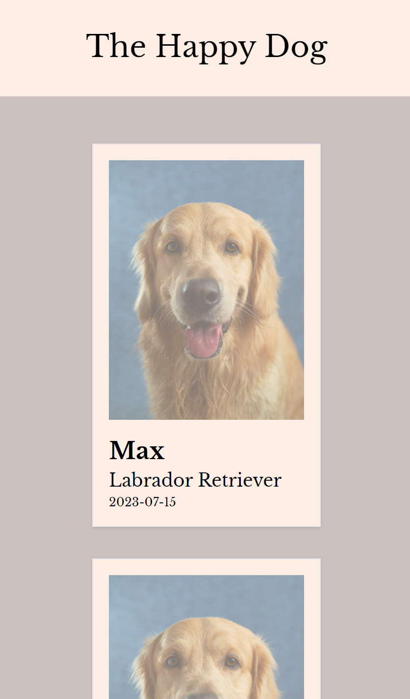
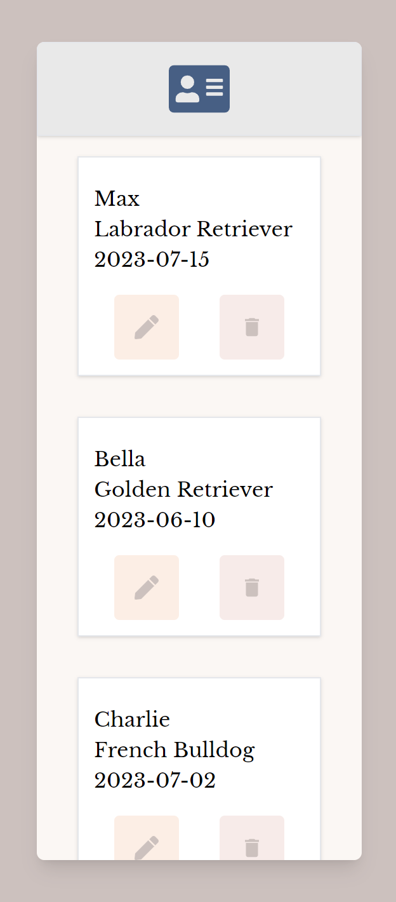
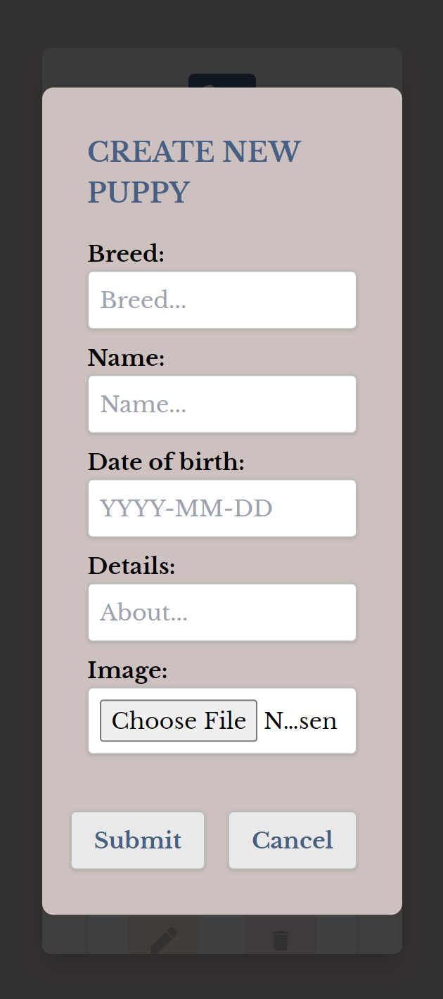
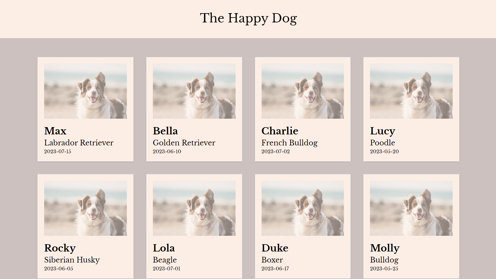
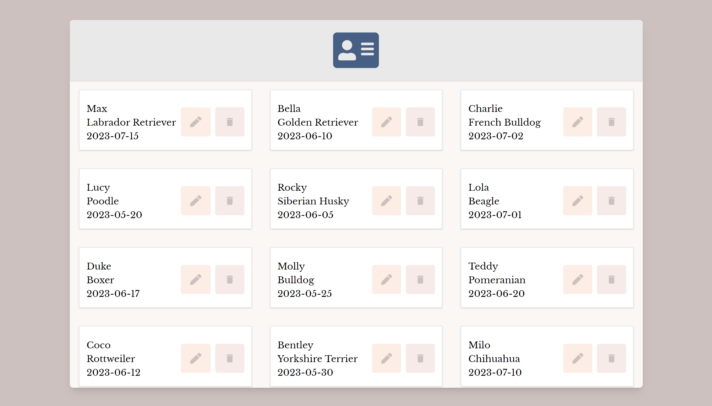

# The Happy Dog App

The Happy Dog App is a React-based web application fully responsive designed to showcase adorable puppies. It consists of two main components: the front office and the back office. The front office displays cards of different dogs, while the back office allows you to manage the dog data.
The back office add, edit and delete data from an external API (https://github.com/Luega/ExpressTS-puppiesAPI).
To set up the app, you will need to use both the frontend and backend components.

## Table of Contents

- [Installation](https://github.com/Luega/FirstTryThree.js/blob/main/README.md#installation)
- [Usage](https://github.com/Luega/FirstTryThree.js/blob/main/README.md#usage)
- [Technologies](https://github.com/Luega/FirstTryThree.js/blob/main/README.md#technologies)
- [License](https://github.com/Luega/FirstTryThree.js/blob/main/README.md#license)





## Installation

1.  Clone the repository

```bash
 git clone https://github.com/Luega/ReactTS-The_happy_dog_app.git
```

2. Change the working directory

```bash
  cd /ReactTS-The_happy_dog_app
```

3. Install dependencies

```bash
  npm install
```

4. Start the development server: npm run start

5. Open your browser and navigate to http://localhost:3000 to access the front office.

6. Open your browser and navigate to http://localhost:3000/admin to access the back office.

## Usage

To use the Puppy App, you will need:

1. Install and run the backend API https://github.com/Luega/ExpressTS-puppiesAPI.

2. Configure the environment variables:

- Open the .env file in the root directory of the frontend project.
- Add the following line and replace yourClientIDfromUnsplashAPI with your Unsplash API client ID:

```bash
  REACT_APP_UNSPLASH_CLIENTID=yourClientIDfromUnsplashAPI
```

## Features

1. Front Office:

- Display cards of various dogs.
- Fetch a default image from the Unsplash API if a card doesn't have an image.

2. Back Office (/admin):

- Add new dogs with their details.
- Edit existing dog information.
- Delete dogs from the displayed collection.

## Technologies

- React: The project is built using the React library, enabling the creation of reusable UI components and managing component state efficiently.
- React Hooks: The app utilizes React hooks such as useState, useEffect, useForm, and useContext to manage state, side effects, and form handling.
- React Router: The React Router library is used to handle routing and navigation within the application.
- Tailwind CSS: The app employs Tailwind CSS for styling and utilizes its utility classes for a streamlined and responsive design.

## License

This project is licensed under the [MIT](https://choosealicense.com/licenses/mit/) License.
